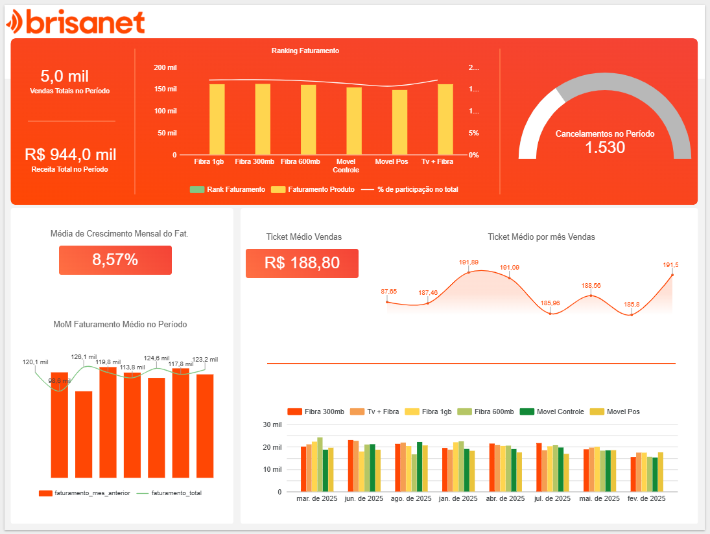

<h2 align="center" >REPOSITORIO</h2>

  <p align="center">
  <a href="https://linkedin.com/in/danielnunesdc">
    
    
    
    
  </a>
</p>

## 📊 Case Telecom – Análise Comercial End-to-End Python + BigQuery + Looker Studio)

Este repositório apresenta a solução de um **case de análise comercial para uma empresa de telecomunicações**, cobrindo todo o fluxo de dados: **tratamento, modelagem, análises analíticas no BigQuery e visualização no Looker Studio**.

O foco do projeto foi **garantir métricas confiáveis**, mesmo diante de **inconsistências propositalmente inseridas nas bases**, respeitando boas práticas de **governança de dados e modelagem analítica**.

### 🎯 Estrutura


---

### 🎯 Objetivo do Case

Analisar dados comerciais para responder às seguintes perguntas de negócio:

- Qual foi o **faturamento total por mês** e sua **evolução no período**?
- Quais **produtos/serviços** mais contribuíram para o faturamento?
- Qual a **proporção de clientes ativos x cancelados**?
- Quais **estados e cidades** mais contribuem para o faturamento e crescimento?

---

### 🧱 Bases de Dados Utilizadas

As seguintes tabelas foram carregadas e tratadas no **BigQuery**:

```text
automacoes-481202.case_telecom.base_clientes
automacoes-481202.case_telecom.base_produtos
automacoes-481202.case_telecom.base_vendas
automacoes-481202.case_telecom.informacoes_vendas
```

> ⚠️ **Observação importante:**
Os identificadores de cliente (id_cliente) não são consistentes entre as bases. Por isso, não foram utilizados para joins entre vendas e clientes, evitando distorção de métricas.

### 🏗️ Arquitetura Analítica

A solução foi estruturada em camadas lógicas, seguindo um padrão próximo a silver / gold layer:

🔹 Camada Fato (Vendas)
- Consolida vendas com produtos e atributos geográficos
- Base para métricas financeiras e temporais

Tabela principal:
```text
tbdc_vendas_enriquecidas
```

🔹 Camada de Agregações Analíticas

Tabelas materializadas para consumo direto no Looker Studio:
```text
tbdc_faturamento_mes_a_mes
tbdc_contrib_faturamento
tbdc_ativos_x_cancelados
tbdc_cidade_estados_mais_crecimento
tbdc_cidade_estados_mais_crecimento_por_mes
```

### 📈 Principais Tabelas Analíticas
1️⃣ Faturamento Mês a Mês

Tabela: tbdc_faturamento_mes_a_mes
- Faturamento total por mês
- Faturamento do mês anterior
- Variação MoM (Month over Month)

2️⃣ Contribuição de Produtos no Faturamento

Tabela: tbdc_contrib_faturamento

- Faturamento por produto
- Participação percentual no total
- Ranking de produtos por receita

3️⃣ Clientes Ativos x Cancelados

Tabela: tbdc_ativos_x_cancelados

- Contagem de clientes por status
- Proporção percentual no total
- Status padronizados (ATIVO, CANCELADO, OUTROS)

4️⃣ Estados e Cidades com Maior Faturamento

Tabela: tbdc_cidade_estados_mais_crecimento

- Faturamento total por estado e cidade
- Visão de contribuição absoluta no período

5️⃣ Crescimento por Estado e Cidade (MoM)

Tabela: tbdc_cidade_estados_mais_crecimento_por_mes

- Faturamento mensal por estado/cidade
- Faturamento do mês anterior
- Crescimento mês a mês (MoM)

### 📊 Métricas-Chave (KPIs)

- Faturamento Total
- Crescimento MoM
- Ticket Médio por Venda
- Participação de Produtos
- Distribuição Geográfica do Faturamento
- Proporção de Clientes Ativos x Cancelados

### 🧠 Decisões Técnicas Relevantes

- Uso extensivo de SAFE_CAST para evitar falhas por dados inválidos
- Separação clara entre:
    - métricas de vendas
    - métricas de clientes
- Não utilização de id_cliente para cruzamento entre tabelas inconsistentes
- Criação de tabelas materializadas, otimizadas para performance no Looker Studio
- Uso de SAFE_DIVIDE para evitar erros de divisão por zero

### 📊 Visualização

O dashboard foi desenvolvido no Looker Studio, consumindo diretamente as tabelas analíticas do BigQuery, com foco em:

- Visão executiva
- Tendência temporal
- Ranking de produtos
- Análise geográfica
- Indicadores de base de clientes




### 🚀 Tecnologias Utilizadas

- **Python** – tratamento e validação dos dados
- **Google BigQuery** – armazenamento e modelagem analítica
- **SQL** (BigQuery Standard SQL) – CTEs, agregações e funções analíticas
- **Looker Studio** – visualização e storytelling de dados

### 📌 Conclusão

O projeto demonstra uma abordagem end-to-end de Analytics, combinando:
- Qualidade de dados,
- Boas práticas de modelagem,
- Clareza de métricas,
- E foco em decisões de negócio.

A solução foi construída para ser **robusta, escalável e confiável**, mesmo diante de dados imperfeitos — cenário comum em ambientes reais.

### 🤝 Contribuindo

Contribuições são bem-vindas! Se você quiser sugerir melhorias ou adicionar novo conteúdo:

1. Faça um fork do repositório
2. Crie uma nova branch
3. Envie um pull request
4. Abra uma issue [issue](../../issues) para discussões

### 🔄 Status do Projeto


--- 

### Entre em contato
  
<a href="https://linkedin.com/in/danielnunesdc" target="blank"></a>
</p><br />

---

### Licença 

Esse projeto está sob a licença MIT. Para mais detalhes acesse [LICENSE](LICENSE.md).

---

Made with :coffee: and ♥ by Daniel Nunes :wave:
